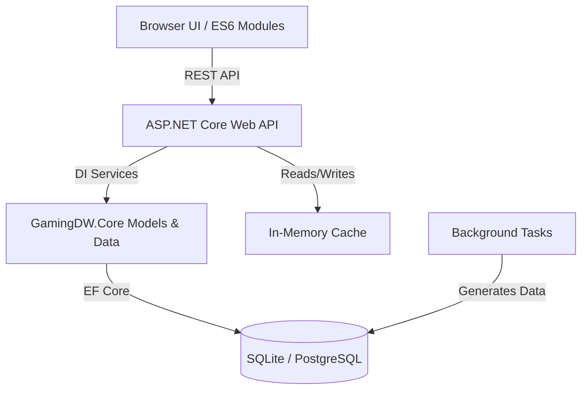

# Gaming Data Warehouse & Reporting Engine

An enterprise-grade, full-stack application for importing, analyzing, and visualizing iGaming marketing performance data. Refactored from a monolithic prototype into a scalable Clean Architecture solution using modern .NET and ES6 modules.

## 🏗️ Architecture

The application is built using a modern decoupled architecture:



### Components
1. **GamingDW.Core**: Domain models, Entity Framework Core `DbContext`, schemas.
2. **GamingDW.WebApp**: Minimal APIs endpoint routing, Business Logic Services, Auth (Identity), Validation (FluentValidation).
3. **GamingDW.Tests**: xUnit and FluentAssertions test covering API behavior and business logic using In-Memory DB.
4. **GamingDW.DataGenerator**: C# Console App utility for seeding thousands of realistic user sessions and gameplay logs.

## ✨ Key Features

- **🔐 Enterprise Security**: Password hashing via ASP.NET Identity, rate limiting, and account lockout after failed attempts.
- **🗄️ Multi-DB Support**: Configurable to use either lightweight SQLite or robust PostgreSQL.
- **🛡️ Audit Trail**: All CUD (Create, Update, Delete) operations and logins are securely tracked with Old/New JSON snapshoting.
- **📥 Excel Import**: Rapid ingestion of daily KPI reports via `.xlsx` parsing (ClosedXML).
- **⏱️ Live Dashboards**: Front-end module `live.js` pings the backend every 30s to summarize live DB activity.
- **🎯 KPI Targets**: Goal-tracking engine computing current pace against monetary or player-count targets.
- **🔄 Automated Background Jobs**: `IHostedService` cron workers dynamically aggregate missing reporting history.
- **🗑️ Soft Deletes**: Global EF Core query filters for `IsDeleted` flags instead of destructive tuple dropping.

## 🚀 Getting Started

### Prerequisites
- .NET 10.0 SDK
- Docker & Docker Compose (optional, for deployment)

### Environment Variables & Configuration
Edit `src/GamingDW.WebApp/appsettings.json` or use env vars:
- `ConnectionStrings:DefaultConnection` - SQLite path.
- `ConnectionStrings:PostgresConnection` - PostgreSQL connection.
- `DatabaseProvider` - Set to `Sqlite` or `PostgreSQL`.
- `ADMIN_DEFAULT_PASSWORD` - Bootstrap password for the `admin` seed user.

### 1. Database Migrations
You must generate the schema before running the app for the first time.
```bash
# Update local SQLite DB (if using SQLite)
dotnet ef database update --project src/GamingDW.Core --startup-project src/GamingDW.WebApp
```

### 2. Running Locally (Development)
```bash
cd src/GamingDW.WebApp
dotnet run
```
Navigate to `http://localhost:5031` for the UI, or `http://localhost:5031/swagger` for API Documentation.

### 3. Testing
Execute the complete regression suite:
```bash
dotnet test GamingDW.slnx -c Release
```

### 4. Running via Docker
The directory includes a multi-stage `Dockerfile` and a `docker-compose.yml` for standing up the API alongside PostgreSQL.
```bash
docker compose up --build -d
```
The application will be exposed on port `8080`.

## 📡 API Examples

### Authentication
```bash
curl -X POST http://localhost:5031/api/auth/login \
  -H "Content-Type: application/json" \
  -d '{"username":"admin", "password":"YourPasswordHere"}'
```

### Upload Daily Report (Excel)
```bash
curl -X POST http://localhost:5031/api/reports/upload \
  -b "auth_token=..." \
  -F "file=@july_marketing.xlsx"
```

## ⚠️ Known Limitations & Future Roadmap
- **Azure AD / SSO Integration**: Currently uses proprietary Identity schema; an OIDC connector is planned.
- **Horizontal Scaling Limits**: The `DailySummaryJob` logic does not yet utilize distributed locking (e.g., Redlock/Redis) preventing duplicate aggregation if running multiple replicas of the API container.
- **WebSocket Streaming**: Live Dashboard polling (HTTP GET / 30s) should eventually be transitioned to SignalR push.
